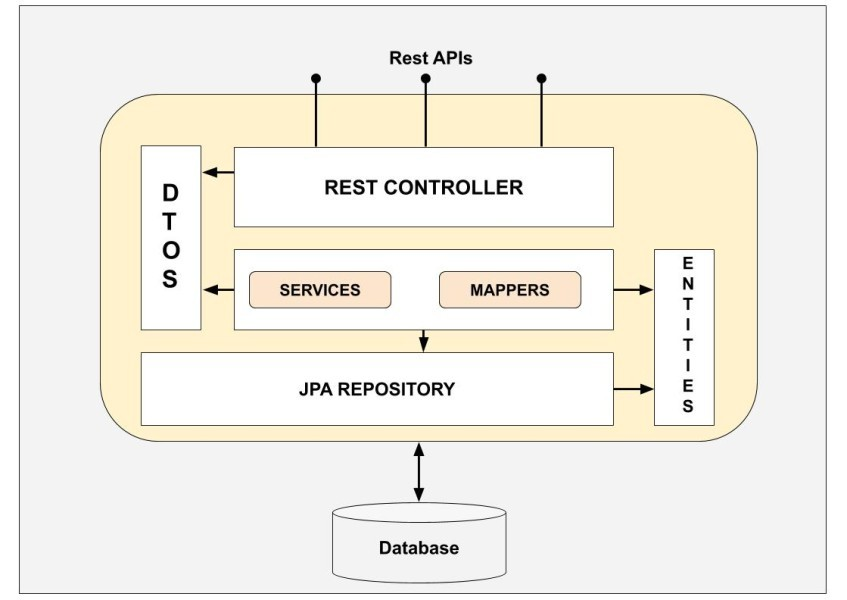

# Human Resource Management System (HRMS)

This is a Human Resource Management System (HRMS) developed using Spring Boot with Kotlin. It provides various features to manage employees, attendance, payroll, performance reviews, and more.

## Features

- **Employees Management**: Manage employee data including personal information, roles, and departments.
- **Attendance**: Track and manage employee attendance records.
- **Payroll**: Calculate and manage employee salaries, bonuses, and deductions.
- **Performance Review**: Conduct performance reviews for employees and track their progress.
- **JWT Authentication**: Secure API endpoints with JSON Web Token (JWT) authentication.
- **Request Body Validations**: Validate request bodies to ensure data integrity and consistency.
- **Proper Responses**: Send appropriate and structured responses to clients for better user experience.
- **AOP (Aspect-Oriented Programming)**: Leverage AOP concepts for cross-cutting concerns such as logging, validation, and security.
- **REST API**: Build RESTful APIs to interact with the HRMS functionalities.
- **Stateless System**: Implement a stateless architecture for scalability and efficiency.
- **JPA with DTO**: Utilize JPA (Java Persistence API) with Data Transfer Objects (DTOs) for database interactions and data transfer.
 
## JWT Authentication

The HRMS uses JWT (JSON Web Token) authentication to secure API endpoints. Users can obtain a JWT token by authenticating with their credentials. This token must be included in the Authorization header of API requests to access protected resources.

## Data Flow in REST



## Getting Started

1. Clone the repository: `git clone https://github.com/vishalmadle13/hrms.git`
2. Navigate to the project directory: `cd hrms`
3. Configure the application properties (database connection, JWT secret, etc.) in the `src/main/resources/application.properties` file.
4. Build the project using Maven:
   ```sh
   mvn clean package

## API Documentation

API documentation can be found [here](https://documenter.getpostman.com/view/24169384/2sA2xh3t5v).

